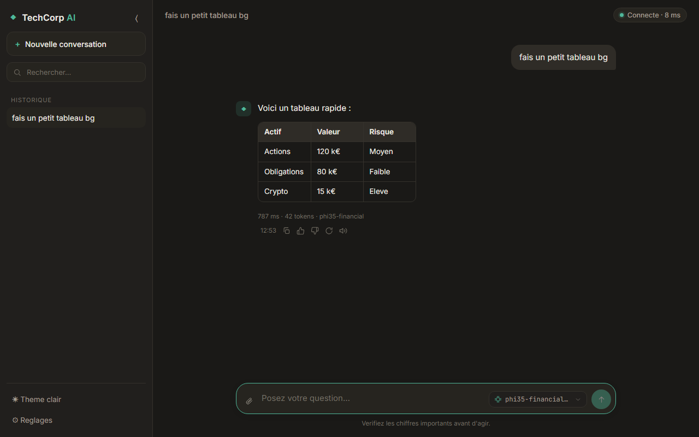
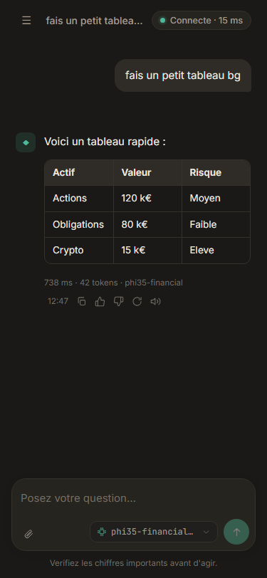

# TechCorp AI - Interface de chat DEV WEB

Interface web React/Vite pour interagir avec l'assistant financier de TechCorp via un serveur
d'inference Ollama. Le navigateur reste en same-origin : il appelle `/api/*`, puis le proxy Vite
ou nginx relaie vers Ollama.

## Apercu

### Vue web



### Vue mobile



## Prerequis

- Node.js 18+
- Un serveur Ollama accessible en local ou via le tunnel INFRA
- Le modele est detecte automatiquement via `/api/tags`

## Lancement recommande

```powershell
./start.ps1
```

```bash
./run.sh
```

L'interface est disponible sur [http://localhost:5173](http://localhost:5173).

Le script lit `OLLAMA_URL` dans cet ordre :

1. Variable d'environnement deja definie.
2. Fichier `.env`.
3. Fallback `http://localhost:11434`.

Le tunnel INFRA change regulierement : ne pas le versionner. Le partager via le canal d'equipe,
puis creer un `.env` local :

```env
OLLAMA_URL=https://<tunnel-infra>
```

Pour cibler temporairement une autre machine :

```powershell
$env:OLLAMA_URL = "http://<IP-INFRA>:11434"; ./start.ps1
```

```bash
OLLAMA_URL=http://<IP-INFRA>:11434 ./run.sh
```

## Bascule INFRA / local

Un toggle est disponible dans la barre du haut :

- **INFRA** : utilise le serveur configure cote script (`OLLAMA_URL` dans `.env` ou variable
  d'environnement).
- **Local** : force `http://localhost:11434`.

Pour la demo, ce toggle permet de repasser rapidement sur Ollama local si le tunnel INFRA est trop
lent ou instable, sans redemarrer l'interface.

## Lancement Docker

```bash
docker compose up -d --build
```

L'interface est disponible sur [http://localhost:8080](http://localhost:8080).

Par defaut, le conteneur cible `host.docker.internal:11434`. Pour une machine INFRA :

```bash
OLLAMA_URL=http://<IP-INFRA>:11434 docker compose up -d --build
```

## Architecture same-origin

Le front ne contacte jamais Ollama directement. Tous les appels passent par `/api/*` :

- En dev : Vite proxy `/api` vers `OLLAMA_URL`.
- En prod/Docker : nginx proxy `/api` vers `OLLAMA_URL` avec `proxy_buffering off` pour garder
  le streaming token par token.

Avantage : pas de CORS cote navigateur, et l'URL reelle du serveur d'inference reste cote serveur.

## Fonctionnalites

- Chat avec streaming token par token et bouton Stop.
- Badge de connexion avec latence et liste automatique des modeles disponibles.
- Fallback automatique si le modele selectionne n'existe pas sur le serveur.
- Historique multi-conversations persistant dans le navigateur.
- Recherche, suppression, edition et regeneration des messages.
- Reglages : modele, temperature, longueur max et prompt systeme.
- Rendu Markdown securise : gras, italique, listes, tableaux et blocs de code.
  Les tableaux larges passent en mode scrollable pour rester lisibles.
- Pieces jointes texte injectees dans le contexte.
- Recadrage local des demandes de code : l'assistant reste dans le domaine finance/business.
- Detection et interruption des reponses qui degenerent ou bouclent.
- Metriques d'inference affichees sous chaque reponse : duree, tokens, modele.
- Palette de commandes (`Ctrl / Cmd + K`) : nouvelle conversation, reglages, theme, copie, export.
- Export de la conversation au format Markdown.
- Theme sombre/clair et interface responsive.
- Deploiement Docker via nginx avec proxy `/api`.

## Securite et robustesse

- Le HTML brut du modele est systematiquement echappe avant rendu : pas d'injection via
  `innerHTML`.
- Le prompt systeme impose une reponse unique, en francais, sans repetition.
- Une garde cote client interrompt la generation si la reponse devient incoherente ou repetitive.
- Les demandes de code sont recadrees localement sans appeler le serveur.

## Tests rapides

```bash
npm test
npm run build
```

Verification Docker :

```bash
docker compose up -d --build
```

Puis ouvrir [http://localhost:8080](http://localhost:8080).

## Raccourcis

- `Entree` : envoyer
- `Maj + Entree` : nouvelle ligne
- `Fleche haut` dans un champ vide : reprendre le dernier message
- `Ctrl / Cmd + K` : ouvrir la palette de commandes
- `Ctrl / Cmd + Shift + K` : nouvelle conversation (aussi dans la palette)

## Equipe

Groupe 6 :

- Julien Sabathe - Cyber
- Raouni Said - Infra
- Onrwa Madi - Dev
- Mohamed Amine El Arjouni - Data
- Lucas Remery - Dev

## Structure

```text
rendu/devweb/
├─ docs/screenshots/       captures du rendu
├─ scripts/                controles rapides du rendu
├─ src/
│  ├─ components/          Sidebar, Composer, Message, SettingsPanel...
│  ├─ lib/                 client Ollama, rendu Markdown, stockage local
│  └─ App.jsx              etat global et orchestration du chat
├─ Dockerfile
├─ docker-compose.yml
├─ nginx.conf.template
├─ start.ps1
├─ run.sh
└─ vite.config.js
```
